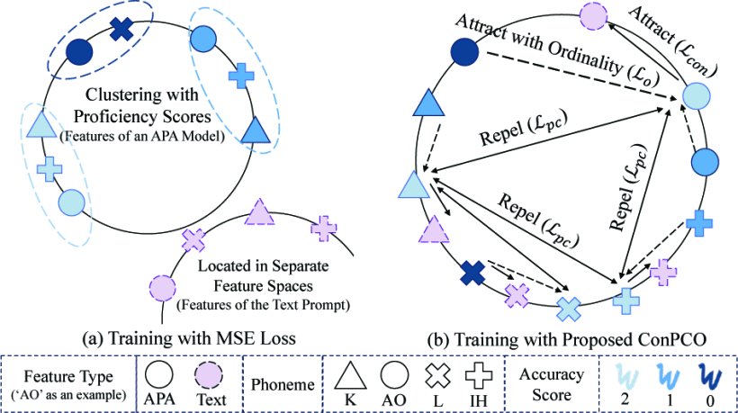
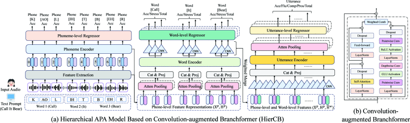
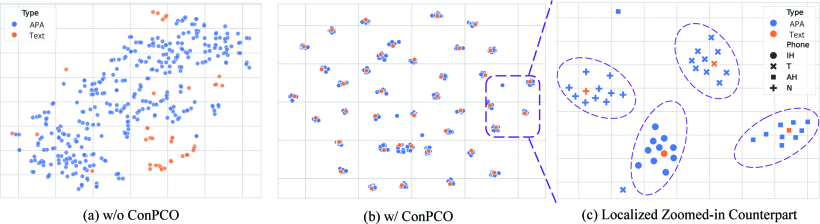

# ConPCO: Preserving Phoneme Characteristics For Automatic Pronunciation Assessment Leveraging Contrastive Ordinal Regularization

*Figure 1: (a) Three limitations identified in existing regression-based APA models. (b) Overview of the proposed ConPCO regularizer.*

*Figure 2: Architecture of the proposed hierarchical APA model (HierCB) with convolution-augmented Branchformer blocks.*

*Figure 3: t-SNE visualization of phoneme representations.*

## Abstract

Automatic pronunciation assessment (APA) manages to evaluate the pronunciation proficiency of a second language (L2) learner in a target language. Existing efforts typically draw on regression models for proficiency score prediction, wherein the models are trained to estimate target values without explicitly accounting for phoneme-awareness in the feature space. In this paper, we propose a contrastive phonemic ordinal regularizer (ConPCO) tailored for regression-based APA models to generate more phoneme-discriminative features while factoring in the ordinal relationships among the regression targets. The proposed ConPCO first aligns the phoneme representations of an APA model and textual embeddings of phonetic transcriptions via contrastive learning. Afterward, the phoneme characteristics are retained by regulating the distances between inter- and intra-phoneme categories in the feature space while allowing for the ordinal relationships among the output targets. We further design and develop a hierarchical APA model to evaluate the effectiveness of our regularizer. A series of experiments conducted on the speechocean762 benchmark dataset suggests the feasibility and effectiveness of our approach in relation to several competitive baselines.

Fueled by the surging demand for foreign language learning, developments of computer-assisted pronunciation training (CAPT) systems have aroused ever-increasing attention amidst the tide of globalization. CAPT systems are designed to offer tailored and informative feedback for L2 (second-language) learners to practice pronunciation skills in stress-free and self-directed learning scenarios [1][2][3]. As an indispensable component of CAPT systems, automatic pronunciation assessment (APA) aims to determine the extent of second language (L2) learners’ oral proficiency and then provide detailed feedback on specific pronunciation aspects pertaining to a target language [4][5].

A de-facto standard for APA systems is instantiated in a reading-aloud learning scenario, where an L2 learner is presented with a text prompt and instructed to pronounce it accordingly [6][7]. Through the synergistic processing of input speech and the reference text prompt, an APA system is anticipated to assess the learner’s speaking skills and provide immediate feedback, including the overall proficiency (holistic scores) or specific aspects of pronunciation (analytic scores). To offer in-depth feedback on learners’ pronunciation quality, recent research endeavors have drawn attention to multi-aspect and multi-granular pronunciation assessments, which devise a unified scoring model to jointly evaluate pronunciation proficiency at various linguistic levels (i.e., phoneme, word, and utterance) with diverse aspects (e.g., accuracy, fluency, and completeness) via advanced parallel [8][9] or hierarchical neural architectures [10]. Due to the continuity of output targets, which can be infinite and boundless [11], existing methods typically adopt a regression loss function, such as mean-squared error (MSE), as the training objective to mimic expert’s evaluations. Although some promising results have been achieved, the distinct features of language units (e.g., phonetic information [12][13] and word semantics [14][15]) are nearly sidelined in the optimization process.

In this work, we identify three limitations in existing regression-based APA models, as illustrated in Fig. 1(a): (1) the phoneme representations of input speech, derived by an APA model, and the textual embeddings of phoneme-level text prompts are located in separate feature spaces, posing challenges for accessing the phoneme scores while retaining awareness of phoneme identities; (2) different phoneme representations belonging to the same proficiency level are inadvertently forced to be close to one another, which would harm the performance of assessment tasks related to pronunciation clarity [16]; and (3) the ordinal relationships among the regression targets are almost overlooked in the design of training objectives, where the ordinal behaviors observed in the label space are not properly reflected in the feature space. To address these limitations, we present a novel training regime, termed contrastive phonemic ordinal regularizer (ConPCO), which enhances regression-based APA models by capturing phoneme characteristics in the feature representations while maintaining the ordinal relationships among the regression targets. As depicted in Fig. 1(b), the proposed ConPCO aligns the output representations from a phoneme encoder of an APA model with the embeddings of phoneme-level text prompt via a contrastive loss, which pulls the paired phoneme representations closer while pushing those of the non-matched pairs apart. To model the nuances of phoneme categories, the feature representations from the same phoneme category are pulled closer together by considering the ordinal relationships of their regression targets, and meanwhile the representations of different categories are forced to be further spread apart. In addition, we also design a novel hierarchical APA model, dubbed HierCB, built upon the newly proposed Convolution-augmented Branchformer blocks to demonstrate the effectiveness of ConPCO. In summary, the main contributions of this work are: (1) to the best of our knowledge, ConPCO is the first attempt to explore contrastive learning for APA models to acquire phoneme-discriminative features; (2) we further develop a simple yet effective hierarchical APA model to verify the feasibility of the proposed training regime, which enhances the Branchformer model [17] with a newly proposed convolution module; and (3) extensive sets of experiments carried out on a public APA dataset confirm the utility of our proposed method which considerably improves the effectiveness of multiple assessments across various linguistic levels.

### A. Contrastive Phonemic Ordinal Regularizer (ConPCO)

As depicted in Fig. 1(b), the proposed ConPCO regularizer consists of three mathematical terms: the contrastive term ${{\mathcal{L}}_{con{}}}$, the phonemic characteristic term ${{\mathcal{L}}_{pc}}$, and the ordinal term ${{\mathcal{L}}_o}\cdot{{\mathcal{L}}_{con}}$. aims to simultaneously project the phoneme-level representations generated from an APA model and the embeddings of phoneme text prompt into a joint feature space. ${{\mathcal{L}}_{pc}}{\text{ and }}{{\mathcal{L}}_o}$ conspire to adjust the distances between inter- and intra-phoneme categories in the feature space, where the former enhances inter-phoneme discrepancy, and the latter renders ordinal relationship among output targets meanwhile preserving the intra-phoneme compactness.

#### Contrastive Term

Let ${{\text{H}}^p} = \left({{\mathbf{h}}_1^p,{\mathbf{h}}_2^p, \ldots ,{\mathbf{h}}_N^p}\right)$ stand for the phoneme representations of an utterance generated by a phoneme encoder of an APA model, and ${{\text{E}}^p} = \left({{\mathbf{e}}_1^p,{\mathbf{e}}_2^p, \ldots ,{\mathbf{e}}_N^p}\right)$ denote the textual embeddings of a phoneme-level text prompt. To obtain a set of paired phoneme representations ${\mathcal{M}} = \left\{ {{{\left({{\mathbf{z}}_i^p,{\mathbf{z}}_i^t}\right)}^t},i = 1, \ldots ,M} \right\}$, we calculate the centroid vectors for each phoneme category in H^*p* and E^*p*, followed by separate linear projections. In set ${\mathcal{M}}$, the *M* × *M* similarities are derived, and the contrastive term ${{\mathcal{L}}_{con{}}}$ seeks to maximize the similarity between paired phoneme representations while minimizing the similarity of unpaired ones at the same time [18][19]. The contrastive term ${{\mathcal{L}}_{con{}}}$ includes two losses, with a temperature hyper-parameter *τ* that controls the strength of penalties on negative samples:

$$
\begin{align*} & {{\mathcal{L}}_{con}} = {{\mathcal{L}}_{p2t}} + {{\mathcal{L}}_{t2p}},\tag{1} \\ & {{\mathcal{L}}_{p2t}} = - \frac{1}{M}\sum\nolimits_{i = 1}^M {\log } \frac{{\exp \left({\phi \left({{\mathbf{z}}_i^p,{\mathbf{z}}_i^t}\right)/\tau }\right)}}{{\sum\nolimits_{j = 1}^M {\exp } \left({\phi \left({{\mathbf{z}}_i^p,{\mathbf{z}}_j^t}\right)/\tau }\right)}},\tag{2} \\ & {{\mathcal{L}}_{t2p}} = - \frac{1}{M}\sum\nolimits_{i = 1}^M {\log } \frac{{\exp \left({\phi \left({{\mathbf{z}}_i^t,{\mathbf{z}}_i^p}\right)/\tau }\right)}}{{\sum\nolimits_{j = 1}^M {\exp } \left({\phi \left({{\mathbf{z}}_i^t,{\mathbf{z}}_j^p}\right)/\tau }\right)}},\tag{3}\end{align*}
$$

where $\phi \left({{\mathbf{z}}_i^p,{\mathbf{z}}_j^t}\right)$ signifies the dot product between *ℓ*2 -normalized vectors ${\mathbf{z}}_i^p$ and ${\mathbf{z}}_j^t$ (viz. cosine similarity). During training phase, the set ${\mathcal{M}}$ is constructed from each batch, where we empirically sample the data instances with the highest proficiency score to calculate centroid vectors.

#### Phonemic Characteristic Term

The phonemic characteristic term ${{\mathcal{L}}_{pc}}$ preserves the phonemic proximity information by minimizing the negative distances between centroid vectors ${\text{z}}_i^p$:

$$
\begin{equation*}{{\mathcal{L}}_{pc}} = - \frac{1}{{M(M - 1)}}\sum\nolimits_{i = 1}^M {\sum\nolimits_{i \ne j} {{{\left\| {{\mathbf{z}}_i^p - {\mathbf{z}}_j^p} \right\|}_2}} } ,\tag{4}\end{equation*}
$$

where ${{\mathcal{L}}_{pc}}$ is equivalent to maximizing the distances between phoneme categories during the optimization process.

#### Ordinal Term

To reflect ordinal relationships of regresion targets in the feature space, the ordinal term ${{\mathcal{L}}_o}$ is defined to minimize the distance between the feature representations ${\mathbf{h}}_i^p$ and their corresponding phoneme centroied vectors ${\mathbf{z}}_i^p$ with relative differences of the proficiency score:

$$
\begin{equation*}{{\mathcal{L}}_o} = \frac{1}{N}\sum\nolimits_{i = 1}^N {{w_i}} {\left\| {{\mathbf{h}}_i^p - {\mathbf{z}}_i^p} \right\|_2},\tag{5}\end{equation*}
$$

where ${w_i} = \left| {C - y_i^p} \right|$ is a compactness weight for each ${\mathbf{h}}_i^p$, reflecting the ordinal behavior within the label space, with $y_i^p$ denoting the corresponding phone-level accuracy score. The tuneable constant ${\mathcal{C}}$ is set to be 3, representing the highest phoneme-level proficiency score.

### B. Hierarchical APA Model Based on Convolution-augmented Branchformer (HierCB)

The overall architecture of our proposed APA model is illustrated in Fig. 2(a), which comprises three main components: phoneme-level modeling, word-level modeling, and utterance-level modeling. Each encoder at different modeling stages adopts the novel convolution-augmented Branchformer block, as shown in Fig. 2(b).

#### Convolution-augmented Branchformer

Attributed to the capability of varying ranged context modeling, Branchformer [17] is more amenable to the construction of a hierarchical APA model in relation to other advanced neural models [20][21]. The Branchformer block consists of two parallel branches, where one branch captures global context through a multi-head self-attention (MHA) module, while the other learns local context via a multi-layer perceptron module with a convolutional gating mechanism (cgMLP) [22]. To effectively represent localized information within pronunciation features at lower levels of granularity (viz. phoneme and word units), the proposed convolution-augmented Branchformer block replaces the cgMLP layers in the original architecture with a convolution module. As shown in Fig. 2(b), our convolution module starts with a gating mechanism that includes a pointwise convolution and a gated linear unit function (GLU) [23]. Stacked on top of the above module, a 1-D depth-wise convolution layer, with a kernel size of 3, is in turn applied to capture local information, which is then normalized with layer normalization and activated by a rectified linear unit (ReLU) function. After that, another pointwise convolution is applied, followed by a dropout layer to prevent overfitting. The other branch retains the MHA module. The entire block is structured as a residual network, with these two branches are further fused by a weighted average operation [17].

#### Hierarchical APA Modeling

For an input utterance of an L2 learner, we first extract various pronunciation features to portray her/his pronunciation quality at the phoneme level, which are then concatenated and projected to obtain a sequence of condensed acoustic features . The feature extraction process is formulated by:

$$
\begin{equation*}{{\text{X}}^p} = {\operatorname{Linear} _p}\left({\left[ {{{\text{E}}^{GOP}};{{\text{E}}^{{\text{Dur }}}};{{\text{E}}^{{\text{Eng }}}};{{\text{E}}^{SSL}}} \right]}\right),\tag{6}\end{equation*}
$$

where Linear*p*(∙) is a linear layer, E*^GOP* is goodness of pronunciation (GOP)-based features [24], E*^Dur* and E*^Eng* are prosodic features of duration and energy statistics [25][26], and E*^SSL* are self-supervised learning (SSL) based features [9]. Subsequently we add phoneme-level textual embeddings E*^P* to X*^p*, and employ a phoneme encoder to obtain aspect representations H*^p*:

$$
\begin{align*} & {\text{H}}_0^p = {{\text{X}}^p} + {{\text{E}}^P}\tag{7} \\ & {{\text{H}}^p} = \operatorname{PhnEnc} \left({{\text{H}}_0^p}\right).\tag{8}\end{align*}
$$

Here, E*^P* is generated by passing a phoneme-level text prompt into a phoneme and position embedding layer, and the phoneme encoder PhnEnc(∙) is a stack of 3 convolution-augmented Branchformer blocks. Next, the regression head is built on top of H*^p* to access phoneme accuracy scores.

For the word-level assessments, we start with word-level attention pooling to derive a word representation vector from its constituent phonemes, achieved by a 1-D depth-wise convolution layer, followed by an MHA layer with an average operation. The word-level input representations X*^w* are computed by individually passing X*^p* and H*^p* into the word-level attention pooling. The resulting representations are then packed together via a linear projection:

$$
\begin{align*} & {\widehat {\text{X}}^w} = {\operatorname{AttPool} _{{{\text{w}}_1}}}\left({{{\text{X}}^p}}\right),\tag{9} \\ & {\widehat {\text{H}}^w} = {\operatorname{AttPool} _{{{\text{w}}_2}}}\left({{{\text{H}}^p}}\right),\tag{10} \\ & {{\text{X}}^w} = {\operatorname{Linear} _w}\left({\left[ {{{\widehat {\text{X}}}^w};{{\widehat {\text{H}}}^w}} \right]}\right).\tag{11}\end{align*}
$$

The word-level textual embeddings E*^w* are added to X*^w*, and a word encoder is employed to generate word-level contextualized representations H*^w*:

$$
\begin{align*} & {\text{H}}_0^w = {{\text{X}}^w} + {{\text{E}}^w}\tag{12} \\ & {{\text{H}}^w} = \operatorname{WordEnc} \left({{\text{H}}_0^w}\right)\tag{13}\end{align*}
$$

where E*^w* are obtained by mapping a text prompt into its corresponding embedding sequence via a word and position embedding layer, and WordEnc(∙) consists of 2 convolutionaugmented Branchformer blocks. Finally, three distinct 1-D depthwise convolution layers are performed on H*^w* to generate word-level aspect representations (i.e., ${{\text{H}}^{{w_1}}},{{\text{H}}^{{w_2}}}{\text{, and }}{{\text{H}}^{{w_3}}}$), which are then transformed into the pronunciation score sequences with the corresponding word-level regression heads.

For the utterance-level assessments, we first merge ${{\text{H}}^{{w_1}}},{{\text{H}}^{{w_2}}}{\text{, and }}{{\text{H}}^{{w_3}}}$ with weighted averaging to obtain word-level output representations ${\overline {\text{H}} ^w}$. Then, the 1-D depth-wise convolution layers are individually stacked on top of X*^p*, H*^p*, and ${\overline {\text{H}} ^w}$. The resulting outputs are further combined with a linear projection to form a sequence of utterance-level input representations ${\text{H}}_0^u$. Then, an utterance encoder is exploited to generate utterance-level contextualized representations H*^u*:

$$
\begin{align*} & {\overline {\text{H}} ^w} = \operatorname{Merge} \left({{{\text{H}}^{{w_1}}},{{\text{H}}^{{w_2}}},{{\text{H}}^{{w_3}}}}\right),\tag{14} \\ & {\text{H}}_0^u = {\operatorname{Linear} _u}\left({\left[ {{\text{D}}{{\text{C}}_1}\left({{{\text{X}}^p}}\right);{\text{D}}{{\text{C}}_2}\left({{{\text{H}}^p}}\right);{\text{D}}{{\text{C}}_3}\left({{{\overline {\text{H}} }^w}}\right)} \right]}\right),\tag{15} \\ & {{\text{H}}^u} = \operatorname{UttEnc} \left({{\text{H}}_0^u}\right),\tag{16}\end{align*}
$$

where Merge(∙) is a weighted average operation, UttEnc(∙) is a single convolution-augmented Branchformer block, and DC1(∙) , DC2(∙), and DC3(∙) are distinct 1-D depthwise convolution layers, each with a kernel size of 3. Finally, five separate attention pooling modules, each with a distinct regression head, are followed to derive the corresponding utterance-level pronunciation scores.

#### Training Objective

The training objective of the multi-aspect and multi-granular pronunciation assessment, ${{\mathcal{L}}_{APA}}$, is calculated as a weighted sum of the mean square error (MSE) losses gathered from different granularity levels. Furthermore, the ConPCO regularizer is incorporated into the optimization process:

$$
\begin{equation*}{\mathcal{L}} = {{\mathcal{L}}_{APA}} + {{\mathcal{L}}_{ConPCO{}}}.\tag{17}\end{equation*}
$$

where ${{\mathcal{L}}_{{p^{jp}}}},{{\mathcal{L}}_{{w^{jw}}}},{\text{ and }}{{\mathcal{L}}_{{u^{ju}}}}$ are phone-level, word-level, and utterance-level losses for disparate aspects, respectively; *Np*, *Nw*, and *N*C mark the numbers of aspects at the phone, word, and utterance levels, respectively; and *λcon*, *λpc*, and *λo* are adjustable parameters controlling the influence of different mathematical terms, respectively.

### A. Experimental Settings

**Dataset.** We conducted APA experiments on the speechocean762 dataset, which is a publicly available dataset specifically designed for research on APA [27]. This dataset contains 5,000 English-speaking recordings spoken by 250 Mandarin L2 learners. The training and test sets are of equal size, and each of them has 2,500 utterances, where pronunciation proficiency scores were evaluated at multiple linguistic granularities with various aspects. Table I summarizes the statistics of the experimental dataset.

**Implementation Details.** For the input feature extraction, the energy and the duration statistics follow the processing flow suggested in [25][26]. SSL-based features are extracted from three pretrained acoustic models including Wav2vec2.0 [28], WavLM [29], and HuBERT [30], where the features are derived from outputs of the last layer [9]. These extracted frame-level features are subsequently aggregated into phoneme-level features based on the phoneme timestamps. The multi-head attention layers used in encoders and attention pooling mechanisms adopt 1 attention head with 24 hidden units. As to the training configuration, we adhere to the settings reported in [16], which conducts 5 independent trials and each trial consists of 100 epochs with different random seeds. In this work, the primary evaluation metric is the Pearson correlation coefficient (PCC), which measures the linear correlation between predicted scores and ground-truth scores. The MSE value is reported for phoneme-level accuracy. Detailed information about our experiments is available at <https://github.com/bicheng1225/ConPCO>.

### B. Experimental Results

#### Qualitative Visualization of Phoneme Representations Generated with Heterogeneous Encoders

To qualitatively examine whether ConPCO aligns the phoneme representations derived from an APA model with the textual embeddings of phoneme-level text prompt, we obtain the learned representations H*^p* and E*^p* from the proposed HierCB, which are then projected and visualized via the t-SNE algorithm in Fig. 3. Comparing among Fig. 3(a) and Fig. 3(b), we can observe that the proposed regularizer effectively projects these two types of phoneme representations into a shared feature space, exhibiting a more coherent distribution. Going one step further, a zoomed-in view is presented in Fig. 3(c), illustrating that the heterogeneous feature representations effectively preserve phoneme characteristics by gathering the features based on their phoneme categories.

#### Performance Evaluation at Lower Granularities

Table II presents the assessment results at phoneme- and word-level granularities, divided into two parts: the first part reports on the results of the APA models that solely rely on GOP-features, while the second part presents the results of the models integrating the SSLbased features as inputs. For fair comparisons, we reproduce the GOPT model using the feature extraction process shown in Eq. (6) and adopt the input features X*^p* as the model inputs (GOPT-SSL). We also report on a variant of HierCB, where the encoder layers adopt the Branchformer blocks (HierBFR), and a phoneme-level regularizer, PCO, is presented which is a special case of ConPCO, with the parameters (*λcon*, *λpc*, *λo*) in Eq. (19) set to (0, 1, 1).

First, a general observation is that the proposed HierCB outperforms the previous APA models in all aspects of pronunciation assessments at both phoneme and word granularities. Specifically, compared to Gradformer (GFR), 3M, and GOPT-SSL models, HierCB achieves average improvements of up to 2.95%, 3.75%, and 3.28% in terms of PCC scores, respectively. With respect to the phoneme-level regularizers PCO and ConPCO, we can observe that both regularizers can enhance the phoneme-accuracy of the HierCB and bring further benefits to word-level assessments. Notably, our ConPCO method can significantly promote the performance of HierCB, achieving the lowest phoneme-level MSE and delivering the best performance in various assessment tasks. Second, benefiting from the large-scale pretrained acoustic models, GOPT-SSL consistently excels the current prevailing approaches, including GOPT and LSTM, across pronunciation assessments of various aspects. Next, the strong baseline method, 3M, demonstrates superior performance on most assessment tasks compared to GOPT-SSL, except for word-level stress. One potential explanation is that 3M incorporates specific phonetic cues in the neural modeling, such as vowel and consonant embeddings, which provide fine-grained information in the phoneme-level modeling and further bring performance gains to word-level assessments via parallel APA model architecture. Finally, in comparison with hierarchical APA models (HierCB, HierBFR, and HiPAMA), HiPAMA trials behind the other two models, and HierCB exhibits superior performance over HierBFR. Benefitting from SSL-based features, both HierCB and HierBFR leverage suprasegmental pronunciation cues and extract distinct features across various granularities of an utterance via the two-branch architecture of the Branchformer, in contrast to HiPAMA. Furthermore, the proposed HierCB consistently outperforms HierBFR across all assessment tasks. This superiority can be attributed to our strategically designed convolution-augmented Branchformer block, which effectively models fine-grained pronunciation features via a series of convolutional layers.

#### Performance Evaluation at Utterance Level

Table III reports on the experimental results for utterance-level pronunciation assessments. The proposed HierCB outperforms or on par those APA models with a parallel architecture in most assessments, notably boosting completeness assessment by 0.352 and 0.387 for 3M and GOPT-SSL, respectively. We attribute the performance gains in utterance-completeness assessment to the proposed convolution-augmented Branchformer block, which effectively captures both local and global pronunciation cues while dynamically modulating the combination weights in disparate granularities. With the phoneme-level regularizer ConPCO, HierCB consistently boosts performance compared to the base model, especially in utterance - accuracy and utterance-total. This result highlights the importance of preserving phoneme characteristics in APA models, which is beneficial towards the pronunciation assessments related to pronunciation clarity.

In this paper, we have proposed a novel training regime, ConPCO, seeking to learn phoneme-aware representations while preserving the ordinal relationships among the regression targets in the learned feature space. In addition, we also developed a hierarchical APA model to verify the efficacy of the proposed regularizer. The practical utility of our method has been verified through extensive experiments on speechocen762 benchmark dataset.

**Limitations and Future Work.** The proposed method is limited to the "reading-aloud" learning scenario and, to some extent, lacks explainability for the provided assessment results. In future work, we plan to examine the proposed method on open-response scenarios, where learners speak freely or respond to a given task or question [31][32]. In addition, the issues of explainable pronunciation feedback are also left as a future extension.
