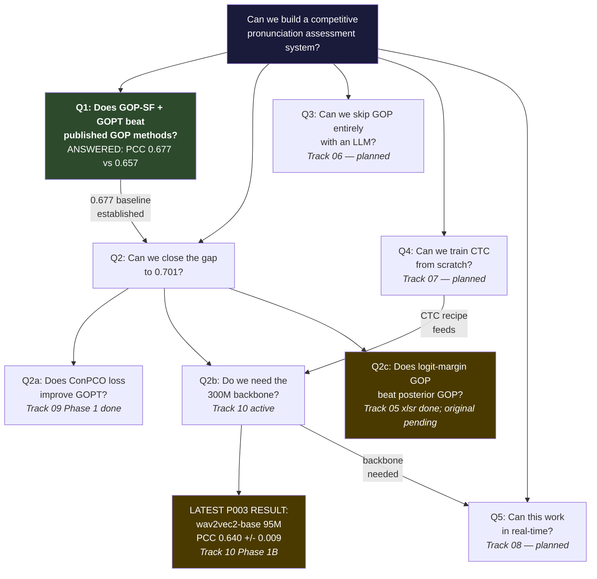

# Peacock-ASR: The Research Map

*Personal lab notebook. Updated as things change.*

Last updated: 2026-03-05

We're building a segmentation-free GOP pipeline using CTC posteriors for
pronunciation assessment on SpeechOcean762. We already beat every published
GOP-based method (PCC 0.677 vs best prior 0.657). The question now is how
close we can get to 0.701 (ConPCO/HierCB), which uses a completely different
paradigm (SSL embeddings + hierarchical scoring, not GOP).

---

## The Question Tree

---

## Status Right Now

**Latest completed:**

- **Track 05 paper-close** — complete across both canonical backends.
  `xlsr-espeak + GOPT` reached `0.6774 +/- 0.0127` PCC (5 seeds), and the final
  scalar closeout shows low-weight logit mixing helps modestly but remains well
  below feature-based scoring. Canonical outputs now live in
  `projects/P001-gop-baselines/experiments/final/results/`.
- **Track 09 Phase 1** — ConPCO loss ablation on GOPT + GOP-SF completed.
  Ordinal entropy adds only a small gain on the 42-d GOP-SF stack; the main
  remaining upside appears to be richer features, not loss alone.
- **Track 10 Phase 1B** — `wav2vec2-base` backbone result landed:
  `0.640 +/- 0.009` PCC with 3.3x fewer parameters than the 300M baseline.

**Next:**

- **Track 10 Phase 1C** — fine-tune/evaluate `HuBERT-base` under the same GOP-SF + GOPT
  protocol as `wav2vec2-base`.
- **Track 09 decision point** — either continue with feature enrichment or fold the current
  result into a broader paper as a negative/clarifying ablation.

---

## Scoreboard (SpeechOcean762, Phone-Level PCC)

|System|PCC|Notes|
|---|---|---|
|GOPT (Kaldi)|0.612|Gong et al. 2022|
|HiPAMA|0.616|Do et al. 2023|
|Gradformer|0.646|Pei et al. 2023|
|HIA|0.657|Han et al. 2026, best prior GOP method|
|**Ours (xlsr-53 + GOPT + GOP-SF)**|**0.677**|Track 05 Phase 1, 5 seeds|
|Ours (wav2vec2-base + GOPT + GOP-SF)|0.640|Track 10 Phase 1B, 5 seeds|
|HierCB + ConPCO|0.701|Yan et al. 2025, target (different paradigm)|

The 0.677 to 0.701 gap is the working frontier. HierCB uses 3164-dim SSL
embeddings vs our 42-dim GOP features, so some of the gap is input richness,
not architecture.

---

## How Tracks Connect

**Track 05 is the foundation.** Every other track inherits its eval protocol
(SpeechOcean762, 3+ seeds, PCC with 95% CI), its GOP-SF feature extraction
code, and its GOPT baseline number (0.677).

**Track 09 plugs directly into Track 05.** It swaps only the loss function
(MSE to ConPCO ordinal entropy). If it helps, the gain propagates to
Track 10 (re-test compact backbones with the better loss) and Track 08
(use the better loss in streaming).

**Track 10 depends on backbone fine-tuning.** The fine-tuning recipe is now
validated well enough to produce a first compact-backbone point
(`wav2vec2-base` at `0.640 +/- 0.009`). Phase 1 continues with additional
95M backbones (especially `HuBERT-base`) against the same xlsr-53 baseline.
If a 95M backbone matches within CI, that's the headline result and it unlocks
Track 08 (streaming only makes sense with a smaller model).

**Track 06 is independent.** Phi-4 / Qwen2-Audio scores pronunciation
without GOP. Can run in parallel any time. If it beats the GOP pipeline,
it reframes the whole research direction.

**Track 07 feeds Track 10.** A Conformer trained from scratch becomes
another point on the Track 10 Pareto plot (PCC vs params).

**Track 08 is last.** Needs a working backbone from Track 05/10.
Streaming before the backbone question is resolved would be premature.

---

## Global Decisions

- **Primary metric: PCC** (not MSE). Matches all published work on SpeechOcean762.
- **Minimum 3 seeds per configuration.** Per lab methodology.
- **BF16 default on L4.** 21% throughput gain, no accuracy loss. Runtime check via `torch.cuda.is_bf16_supported()`.
- **Compact backbones are the active priority.** ConPCO phase 1 is complete;
  further P002 work needs a stronger feature-based justification.
- **Project workspaces are the source of truth.** Use this file as the front
  door only; project-level ledgers and runbooks outrank this summary.

---

## Track Workspaces

|Track|Question|Workspace|
|---|----------|-----------|
|05|Does GOP-SF + GOPT beat published methods?|`projects/P001-gop-baselines/docs/`|
|06|Can an LLM score pronunciation without GOP?|`projects/P005-llm-pronunciation/docs/`|
|07|Can we train a CTC model from scratch?|`projects/P004-training-from-scratch/docs/`|
|08|Can pronunciation be scored without a known transcript?|`projects/P006-realtime-streaming/docs/`|
|09|Does ConPCO loss improve GOPT?|`projects/P002-conpco-scoring/docs/`|
|10|Do we need the 300M backbone?|`projects/P003-compact-backbones/docs/`|
