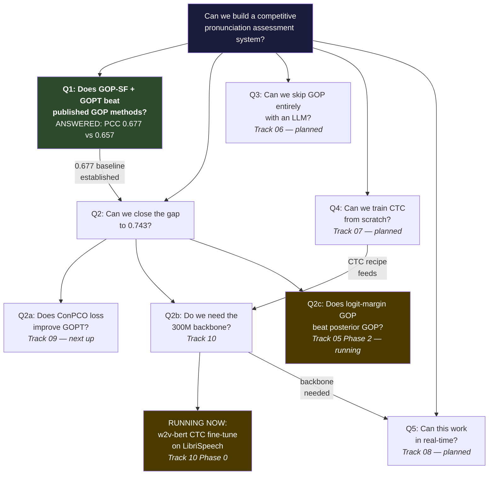

# Peacock-ASR: The Research Map

*Personal lab notebook. Updated as things change.*

Last updated: 2026-03-03

We're building a segmentation-free GOP pipeline using CTC posteriors for
pronunciation assessment on SpeechOcean762. We already beat every published
GOP-based method (PCC 0.677 vs best prior 0.657). The question now is how
close we can get to 0.743 (ConPCO/HierCB), which uses a completely different
paradigm (SSL embeddings + hierarchical scoring, not GOP).

---

## The Question Tree

---

## Status Right Now

**Running:**

- **Track 05 Phase 2** — logit-scalar GOP variants. Runs in `runs/2026-03-03_*`.
  Testing whether margin-based GOP features beat posterior GOP features.
- **Track 10 Phase 0** (backbone prep) — `training/train_phoneme_head.py` on
  RunPod L4. Fine-tuning w2v-bert-2.0 with CTC on LibriSpeech (41 ARPABET tokens).
  Validates the recipe Track 10 Phase 1 needs for wav2vec2-base and HuBERT-base.
  Model pushes to `Peacockery/w2v-bert-phoneme-en` on HuggingFace Hub.

**Done:**

- **Track 05 Phase 1** — xlsr-53 + GOPT baseline. PCC 0.677 +/- 0.013 (5 seeds).
  Beats all published GOP methods. Runs in `runs/2026-03-03_001037_track05_phase1_baseline/`.

**Next:**

- **Track 09 Phase 1** — Port ConPCO loss into GOPT trainer. Loss function swap only,
  same architecture, same features. Code at `references/ConPCO/`. Smallest possible
  experiment to test whether ordinal loss improves phone-level PCC.
- **Track 05 Phase 2 completion** — finish logit-scalar variants, decide whether
  logit GOP replaces posterior GOP as baseline.

---

## Scoreboard (SpeechOcean762, Phone-Level PCC)

|System|PCC|Notes|
|---|---|---|
|GOPT (Kaldi)|0.612|Gong et al. 2022|
|HiPAMA|0.616|Do et al. 2023|
|Gradformer|0.646|Pei et al. 2023|
|HIA|0.657|Han et al. 2026, best prior GOP method|
|**Ours (xlsr-53 + GOPT + GOP-SF)**|**0.677**|Track 05 Phase 1, 5 seeds|
|HierCB + ConPCO|0.743|Yan et al. 2025, target (different paradigm)|

The 0.677 to 0.743 gap is the working frontier. HierCB uses 3164-dim SSL
embeddings vs our 42-dim GOP features, so some of the gap is input richness,
not architecture.

---

## How Tracks Connect

**Track 05 is the foundation.** Every other track inherits its eval protocol
(SpeechOcean762, 3+ seeds, PCC with 95% CI), its GOP-SF feature extraction
code, and its GOPT baseline number (0.677).

**Track 09 plugs directly into Track 05.** It swaps only the loss function
(MSE to ConPCO ordinal entropy). If it helps, the gain propagates to
Track 10 (re-test compact backbones with the better loss) and Track 08
(use the better loss in streaming).

**Track 10 depends on backbone fine-tuning.** Phase 0 (running now on
RunPod L4) validates the CTC fine-tuning recipe. Phase 1 then does the
backbone swap (wav2vec2-base 95M, HuBERT-base 95M vs xlsr-53 300M).
If a 95M backbone matches within CI, that's the headline result and it
unlocks Track 08 (streaming only makes sense with a smaller model).

**Track 06 is independent.** Phi-4 / Qwen2-Audio scores pronunciation
without GOP. Can run in parallel any time. If it beats the GOP pipeline,
it reframes the whole research direction.

**Track 07 feeds Track 10.** A Conformer trained from scratch becomes
another point on the Track 10 Pareto plot (PCC vs params).

**Track 08 is last.** Needs a working backbone from Track 05/10.
Streaming before the backbone question is resolved would be premature.

---

## Global Decisions

- **Primary metric: PCC** (not MSE). Matches all published work on SpeechOcean762.
- **Minimum 3 seeds per configuration.** Per lab methodology.
- **BF16 default on L4.** 21% throughput gain, no accuracy loss. Runtime check via `torch.cuda.is_bf16_supported()`.
- **ConPCO before compact backbones.** Higher potential PCC gain, lower effort.
- **Track workspaces are source of truth.** This file does not duplicate experiment plans, claim maps, or run logs. Those live in each track's ABLATION_PLAN and EVIDENCE_LEDGER.
- **w2v-bert CTC fine-tune = Track 10 Phase 0.** Fine-tuning a pretrained SSL model with a CTC head is backbone preparation (Track 10), not training from scratch (Track 07).

---

## Track Workspaces

|Track|Question|Workspace|
|---|----------|-----------|
|05|Does GOP-SF + GOPT beat published methods?|`projects/P001-gop-baselines/docs/`|
|06|Can an LLM score pronunciation without GOP?|`track06_llm_pronunciation/`|
|07|Can we train a CTC model from scratch?|`track07_training_from_scratch/`|
|08|Can GOP-SF work in real-time?|`track08_realtime_streaming/`|
|09|Does ConPCO loss improve GOPT?|`track09_conpco_scoring/`|
|10|Do we need the 300M backbone?|`track10_compact_backbones/`|
