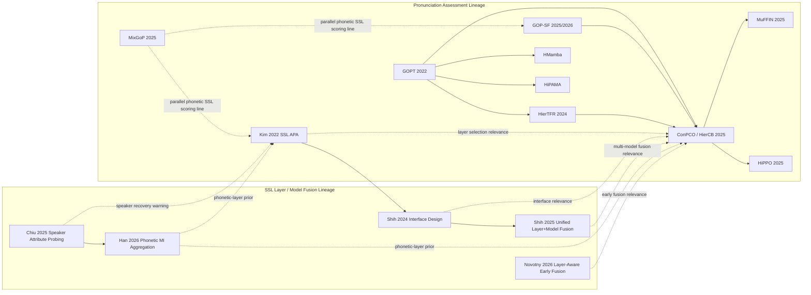

# Pronunciation Literature Graph

Date: 2026-03-22

Purpose: map the active pronunciation-assessment literature around `P002` / `P003` / richer SSL feature fusion, separate validated facts from working hypotheses, and surface the main missing ablations.

## Scope

This note is built from:

- repo-local paper notes and LaTeX under `docs/papers/`
- repo-local project docs under `projects/P002-conpco-scoring/docs/` and `projects/P003-compact-backbones/docs/`
- spot web verification for papers that are clearly part of the active thread

Labels used below:

- `Validated`: directly supported by repo-local notes/code or a checked public source
- `Inference`: synthesis across sources, not directly claimed by a single paper
- `Hypothesis`: candidate test or gap, not yet validated

## Graph

## Node Map

| Node | Role | Task level | Feature contract | Fusion / interface |
| --- | --- | --- | --- | --- |
| `GOPT` | core GOP scorer baseline | phone, word, utterance | GOP-style features | flat transformer scorer |
| `Kim 2022` | SSL-only pronunciation scoring baseline | utterance | fine-tuned SSL + text | all-layer average |
| `GOP-SF` | our stronger feature-extraction line | phone-first scorer stack | segmentation-free GOP features | not a layer-fusion paper |
| `HierTFR` | hierarchical APA scorer | phone, word, utterance | GOP + energy + duration | hierarchical transformer, selective fusion |
| `ConPCO / HierCB` | richer hierarchical APA + ordinal/contrastive regularizer | phone, word, utterance | GOP + energy + duration + 3xSSL | static concat of 3 SSL streams, then projection |
| `MuFFIN` | joint APA + MDD extension | phone, word, utterance + MDD | hierarchical + ConPCO-style regularization | not a layer-fusion paper |
| `HiPPO` | ASR-mediated spoken-language APA extension | phone, word, utterance | ASR transcript + hierarchical scorer | not a layer-fusion paper |
| `HMamba` | alternative hierarchical scorer family | phone, word, utterance | GOP/prosody/SSL | scorer-family alternative |
| `HiPAMA` | hierarchical scorer alternative | phone, word, utterance | pronunciation features | scorer-family alternative |
| `MixGoP` | allophony-aware SSL scoring line | pronunciation scoring | frozen SSL features + GMM phoneme modeling | layer-sensitive SSL use |
| `Shih 2024` | interface-design paper | general speech tasks | SSL hidden states | weighted sum vs HConv and others |
| `Shih 2025` | unified model+layer fusion | general speech tasks | multiple SSL / SFM hidden states | joint layer+model fusion |
| `Chiu 2025` | probing paper on speaker attributes across layers | representation analysis | SSL layerwise features | no downstream scorer, probes layers |
| `Han 2026` | phonetic MI aggregation paper | speech enhancement context | SSL layerwise features | MI-guided aggregation |
| `Novotny 2026` | layer-aware early fusion paper | cognitive-status classification | acoustic + linguistic embeddings | learned layer-aware early fusion |

## Validated Facts

### 1. Final-layer-only is not a safe default for pronunciation scoring

- `Kim et al. 2022` explicitly extracts transformer representations from all SSL layers and reports that all-layer averaging beats both a single transformer layer and the local convolutional output.
- `Chiu et al. 2025` reports that larger SSL models can recover speaker identity again in deep layers, while prosodic attributes peak in intermediate layers.
- `Han et al. 2026` reports that phonetic mutual information peaks in upper layers, which gives a principled reason to weight or select layers instead of taking the final layer by default.

Status: `Validated`

### 2. Weighted sum should be treated as a baseline interface, not the answer

- `Shih et al. 2024` reframes layerwise weighted sum as just one interface and reports that it is suboptimal across multiple tasks, especially with deeper upstream models.
- The same line introduces hierarchical convolution (`HConv`) as a stronger alternative.
- `Shih et al. 2025` extends that thread and jointly optimizes model fusion and layer fusion instead of doing them separately.

Status: `Validated`

### 3. Our `P002` reproduction path is not doing SSL layer harvesting

- The local `ConPCO/HierCB` path loads three frozen tensors:
  - `hubert_feat_v2`
  - `w2v_300m_feat_v2`
  - `wavlm_feat_v2`
- Those tensors are concatenated and projected down before the scorer.
- The ConPCO regularizer uses intermediate scorer features, not hidden layers from the SSL encoders themselves.

Status: `Validated`

### 4. The Yan/Chen pronunciation line and the fusion/interface line are adjacent, not integrated

- `HierTFR`, `ConPCO`, `MuFFIN`, and `HiPPO` are all in the local pronunciation-assessment vault and form a clear APA lineage.
- `Shih 2024`, `Shih 2025`, `Chiu 2025`, `Han 2026`, and `Novotny 2026` are in the local SSL/fusion vault and form a clear layer/interface lineage.
- I do not see a paper in the local pronunciation lineage that directly imports the `Shih` interface machinery into phone-level APA.

Status: `Validated`

### 5. `MixGoP` is a real adjacent line, but it is not integrated into the repo-local project docs yet

- The local paper vault contains `MixGoP` as `Leveraging Allophony in Self-Supervised Speech Models for Atypical Pronunciation Assessment`.
- The repo-local `P002` / `P003` docs do not currently reference it.

Status: `Validated`

## Repo Drift

### 1. `HierTFR` and `HierCB` are conflated in local `P002` docs

- Some local `P002` docs refer to `HierTFR/HierCB` as if they were interchangeable.
- The upstream `ConPCO` bundle treats them as separate model entries.

Why it matters:

- it blurs whether a gain came from hierarchy alone, richer feature contract, branchformer/convolution changes, or ConPCO itself

### 2. `HMamba` / `HiPAMA` ownership is split between `P002` and `P003`

- `P002` frames them as richer scorer alternatives in the same experimental space.
- `P003` also still frames them as scorer-family alternatives for the backbone paper.

Why it matters:

- the literature map is cleaner than the current project scoping

### 3. `MuFFIN` and `HiPPO` are in the paper vault but not yet wired into the active evidence ledgers

- the bibliography has advanced further than the current experiment-facing documents

Why it matters:

- this creates blind spots in the “what is SOTA now?” picture

## Cross-Line Synthesis

### APA lineage

- `GOPT` establishes the flat transformer scorer baseline.
- `HierTFR` argues for hierarchical phone→word→utterance modeling plus selective fusion and pretraining.
- `ConPCO / HierCB` adds richer features and a phoneme-preserving regularizer.
- `MuFFIN` extends the same family into joint APA + MDD.
- `HiPPO` pushes the same family into ASR-mediated spoken-language assessment.

### SSL representation / fusion lineage

- `Kim 2022` says all-layer averaging can be a useful pronunciation-scoring interface.
- `Shih 2024` says weighted sum is usually not the best interface.
- `Shih 2025` says layer fusion and model fusion should be treated jointly.
- `Chiu 2025` says deep layers of large models may still carry speaker identity.
- `Han 2026` says phonetic mutual information gives a principled layer-selection prior.
- `Novotny 2026` says early fusion across layers/streams can beat late fusion in another speech-assessment domain.

### Parallel line that looks under-exploited here

- `MixGoP` treats SSL feature space as allophony-rich rather than as a single canonical phoneme cluster.
- That is a different move from both `ConPCO` and `Kim`.
- It suggests an alternate path where the key problem is not only “which layer?” but also “what geometry are we assuming inside that layer?”

## Main Gaps

### Gap A. No direct pronunciation paper in the local corpus tests interface design as the independent variable

What exists:

- `Kim`: all-layer average
- `ConPCO / HierCB`: static 3-model concat
- `Shih`: weighted sum vs convolutional interface vs other interfaces

What is missing:

- a controlled APA ablation where the upstream SSL source is fixed and only the interface changes

Status: `Validated gap`

### Gap B. No direct pronunciation paper in the local corpus tests phonetic-layer selection against speaker recovery risk

What exists:

- `Chiu`: deep-layer speaker recovery warning
- `Han`: upper-layer phonetic MI signal
- `Kim`: all-layer averaging helps on utterance scoring

What is missing:

- a pronunciation-scoring study that explicitly excludes late speaker-heavy layers or compares:
  - final layer
  - all-layer average
  - upper-mid slice
  - MI-guided subset

Status: `Validated gap`

### Gap C. Multi-model fusion exists in speech, but not in our APA line as a learned interface

What exists:

- `ConPCO / HierCB`: concatenates three frozen SSL streams
- `Shih 2025`: joint model+layer fusion

What is missing:

- an APA paper that replaces raw multi-model concat with a learned joint model+layer interface

Status: `Validated gap`

### Gap D. Allophony-aware SSL scoring is parallel to, not integrated with, the Yan/Chen line

What exists:

- `MixGoP`: allophony-aware GMM modeling on SSL features
- `ConPCO`: phoneme-preserving regularization on richer hierarchical scorer

What is missing:

- any paper in the local corpus that combines:
  - hierarchical APA
  - learned layer/model fusion
  - allophony-aware phoneme geometry

Status: `Validated gap`

## High-Signal Hypotheses

### H1. Upper-mid layer fusion may beat final-layer-only and all-layer-average for phone-level APA

Reason:

- `Kim` shows all-layer average beats single-layer and convolutional output on utterance scoring.
- `Chiu` shows deep layers in large models can re-express speaker identity.
- `Han` says phonetic MI peaks in upper layers, not necessarily the final layer.

Status: `Hypothesis`

### H2. A learned convolutional interface may beat weighted sum and raw concat in phone-level APA

Reason:

- `Shih 2024` consistently favors `HConv` over weighted sum in general speech tasks.
- `ConPCO / HierCB` currently uses raw multi-stream concat plus projection.

Status: `Hypothesis`

### H3. Joint model+layer fusion should be more data-efficient than blindly stacking three SSL models

Reason:

- `Shih 2025` says separate layer fusion then model fusion is weaker than joint fusion.
- the current `P002` feature blob is large and likely redundant.

Status: `Hypothesis`

### H4. Allophony-aware scoring and phoneme-preserving regularization are complementary, not redundant

Reason:

- `MixGoP` focuses on subclusters within phoneme classes.
- `ConPCO` focuses on preserving phoneme discrimination and ordinal geometry.

Status: `Hypothesis`

## Ablation Bank

These are not validated results. They are the cleanest missing tests implied by the literature graph.

| ID | Fixed upstream | Interface / representation change | Why it exists |
| --- | --- | --- | --- |
| `A1` | one SSL backbone | final layer vs all-layer average | reproduce `Kim`-style baseline in our APA setting |
| `A2` | one SSL backbone | final layer vs upper-mid layer slice | test `Chiu` + `Han` implication |
| `A3` | one SSL backbone | weighted sum vs `HConv` | import `Shih 2024` into APA |
| `A4` | two SSL backbones | raw concat vs joint model+layer fusion | import `Shih 2025` into APA |
| `A5` | one SSL backbone | single Gaussian GOP-style scoring vs `MixGoP`-style allophony modeling | test geometry assumption |
| `A6` | `ConPCO` feature stack | raw 3xSSL concat vs learned fusion block | direct replacement test in `P002` style setup |

## Source Anchors

Repo-local anchors:

- `docs/papers/pronunciation-assessment/2204.03863-[Kim et al, 2022]-ssl-pronunciation-assessment-wav2vec-hubert/paper.md`
- `docs/papers/asr-backbones/2406.12209-[Shih et al, 2024]-interface-design-self-supervised-speech-models/main_camera_ready.tex`
- `docs/papers/asr-backbones/2511.08389-[Shih et al, 2025]-unifying-model-layer-fusion/paper.md`
- `docs/papers/asr-backbones/2511.08389-[Shih et al, 2025]-unifying-model-layer-fusion/latex-source/sections/interface_definition.tex`
- `docs/papers/asr-backbones/2501.05310-[chiu, 2025]-probing-speaker-attributes-ssl-representations/paper.md`
- `docs/papers/asr-backbones/2601.22480-[Han et al, 2026]-speech-representation-aggregation-phonetic-mi/paper.md`
- `docs/papers/pronunciation-assessment/2502.07029-[Choi et al, 2025]-allophony-ssl-atypical-pronunciation/paper.md`
- `docs/papers/pronunciation-assessment/[Yan et al, 2024]-an-effective-pronunciation-assessment-approach-leveraging-hierarchical-transformers-and-pre-training-strategies/paper.md`
- `docs/papers/pronunciation-assessment/[Yan et al, 2025]-conpco-preserving-phoneme-characteristics-for-automatic-pronunciation-assessment-leveraging-contrastive-ordinal-regularization/paper.md`
- `docs/papers/pronunciation-assessment/[Yan et al, 2025]-muffin-multifaceted-pronunciation-feedback-model-with-interactive-hierarchical-neural-modeling/paper.md`
- `docs/papers/pronunciation-assessment/[Yan et al, 2025]-hippo-exploring-a-novel-hierarchical-pronunciation-assessment-approach-for-spoken-languages/paper.md`
- `projects/P002-conpco-scoring/code/reproduce_conpco.py`
- `projects/P002-conpco-scoring/third_party/ConPCO/src/models/gopt_ssl_3m_bfr_cat_utt_clap.py`
- `projects/P002-conpco-scoring/third_party/ConPCO/src/traintest_eng_dur_ssl_3m_HierBFR_conPCO_norm.py`
- `projects/P002-conpco-scoring/code/p002_conpco/gopt_track09.py`
- `projects/P002-conpco-scoring/docs/EVIDENCE_LEDGER.md`
- `projects/P002-conpco-scoring/docs/INDEX.md`
- `projects/P003-compact-backbones/docs/EVIDENCE_LEDGER.md`

Web-verified anchors:

- Kim 2022: https://arxiv.org/abs/2204.03863
- Shih 2024: https://arxiv.org/abs/2406.12209
- Shih 2025: https://arxiv.org/abs/2511.08389
- Chiu 2025: https://arxiv.org/abs/2501.05310
- Han 2026: https://arxiv.org/abs/2601.22480
- MixGoP 2025: https://arxiv.org/abs/2502.07029
