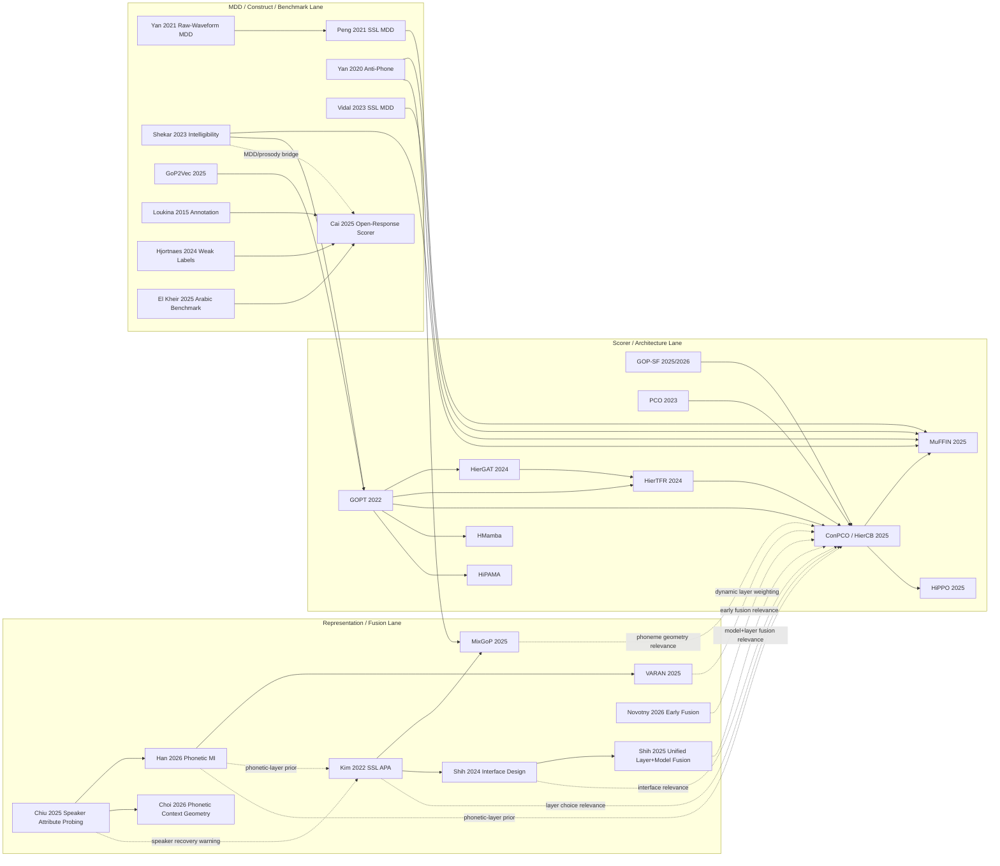

# Pronunciation Literature Graph

Date: 2026-03-22

Purpose: map the active pronunciation-assessment literature around `P002` / `P003`, include the papers that were missed in the first narrow pass, and separate validated facts from working hypotheses.

## Scope

Built from:

- repo-local paper notes and LaTeX under `docs/papers/`
- repo-local project docs under `projects/P002-conpco-scoring/docs/` and `projects/P003-compact-backbones/docs/`
- spot web verification for specific papers that matter to the active thread

Labels:

- `Validated`: directly supported by repo-local notes/code or a checked public source
- `Inference`: synthesis across sources, not directly claimed by one paper
- `Hypothesis`: candidate test or gap, not yet validated

## Coverage Tiers

### Tier 1. First-tier for the current agenda

- `GOPT`
- `GOP-SF`
- `PCO`
- `HierGAT`
- `HierTFR`
- `ConPCO / HierCB`
- `MuFFIN`
- `HiPPO`
- `Kim 2022`
- `MixGoP`
- `Shih 2024`
- `Shih 2025`
- `Chiu 2025`
- `Han 2026`
- `VARAN`
- `Choi 2026` phonetic-context geometry
- `Cai 2025`

### Tier 2. Adjacent but important

- `Peng 2021`
- `Vidal 2023`
- `Yan 2020 anti-phone`
- `Yan 2021 raw-waveform MDD`
- `Shekar 2023`
- `GoP2Vec`
- `Novotny 2026`

### Tier 3. Guardrail / construct / benchmark context

- `Loukina 2015`
- `Hjortnæs 2024`
- `El Kheir 2025`

## Three-Lane Graph

## Node Map

| Node | Role | Task level | Feature / supervision contract | Why it matters |
| --- | --- | --- | --- | --- |
| `GOPT` | core scorer baseline | phone, word, utterance | GOP-style features | main baseline family |
| `GOP-SF` | stronger feature extractor | phone-first scorer stack | segmentation-free GOP | our local strong feature line |
| `PCO` | loss precursor | phone-first APA | phoneme-distinct ordinal loss | direct loss ancestor of `ConPCO` |
| `HierGAT` | early hierarchical APA branch | phone, word, utterance | pronunciation features + graph hierarchy | missing middle node in Yan/Chen line |
| `HierTFR` | hierarchical APA scorer | phone, word, utterance | GOP + energy + duration | architecture and pretraining branch |
| `ConPCO / HierCB` | hierarchical APA + phoneme regularizer | phone, word, utterance | GOP + energy + duration + 3xSSL | active `P002` target |
| `MuFFIN` | APA↔MDD bridge | phone, word, utterance + MDD | hierarchical + ConPCO-style regularization | central joint-model bridge |
| `HiPPO` | spoken-language APA branch | phone, word, utterance | ASR transcript + hierarchical scorer | open/simulated free-speaking direction |
| `HMamba` | scorer-family alternative | phone, word, utterance | GOP / prosody / SSL | alternative head family |
| `HiPAMA` | scorer-family alternative | phone, word, utterance | pronunciation features | alternative head family |
| `Kim 2022` | SSL-only pronunciation scoring branch | utterance | fine-tuned SSL + text | all-layer-average reference |
| `MixGoP` | allophony-aware SSL scoring | pronunciation scoring | frozen SSL features + GMM phoneme modeling | strongest parallel geometry line |
| `Shih 2024` | interface paper | general speech tasks | SSL hidden states | weighted sum vs HConv |
| `Shih 2025` | unified layer+model fusion | general speech tasks | multiple SSL / SFM hidden states | joint model+layer fusion |
| `Chiu 2025` | speaker/prosody layer probing | representation analysis | SSL layerwise probes | warns against final-layer simplification |
| `Han 2026` | phonetic-MI aggregation | speech enhancement context | SSL layerwise features | principled phonetic layer prior |
| `VARAN` | dynamic layer weighting | general downstream SSL tasks | SSL hidden states | input-dependent layer weighting |
| `Choi 2026` | phonetic-context geometry | representation analysis | SSL hidden states | subspace view of phonetic context |
| `Novotny 2026` | layer-aware early fusion | cognitive-status classification | acoustic + linguistic embeddings | early-fusion idea |
| `Peng 2021` | SSL-for-MDD backbone paper | phone-level MDD | wav2vec2 / XLSR fine-tuning | low-resource SSL diagnosis evidence |
| `Yan 2020 anti-phone` | label-space non-canonical modeling | MDD | anti-phone labels | explicit non-canonical phone structure |
| `Yan 2021 raw-waveform` | raw-front-end MDD paper | MDD | raw waveform encoder | alternate answer to better diagnosis features |
| `Vidal 2023` | SSL-MDD comparison node | MDD | SSL representations | target-task training vs transfer angle |
| `Shekar 2023` | intelligibility bridge | intelligibility prediction | GOPT + wav2vec2 MDD + prosody | scoring is not enough alone |
| `GoP2Vec` | few-shot GOP-derived scoring | utterance | augmented GoP -> i-vector-like embedding | low-label branch |
| `Loukina 2015` | annotation / construct paper | scoring system design | expert vs crowd annotation | label design changes the task |
| `Hjortnæs 2024` | weak-label warning | pronunciation proxy labels | Common Voice votes | generic crowd votes are poor labels |
| `Cai 2025` | construct-aligned open-response scorer | open-response pronunciation scoring | human expert ratings + fairness analysis | operational/validity lane |
| `El Kheir 2025` | non-English benchmark node | Arabic pronunciation assessment | benchmark-building | generalization / benchmark context |

## Validated Facts

### 1. Final-layer-only is not a safe default

- `Kim 2022` extracts all transformer layers and reports all-layer averaging beats a single transformer layer and the local convolutional output.
- `Chiu 2025` shows large models can recover speaker identity in deep layers.
- `Han 2026` shows phonetic MI peaks in upper layers, not simply “the last layer”.

Status: `Validated`

### 2. Weighted sum is a baseline interface, not the answer

- `Shih 2024` treats weighted sum as one interface and says it is suboptimal.
- `Shih 2025` goes further and says layer fusion and model fusion should be optimized jointly.
- `VARAN` adds a third angle: input-dependent dynamic layer weighting.

Status: `Validated`

### 3. Our current `P002` path does not harvest SSL hidden layers

- The local `ConPCO / HierCB` path loads three frozen SSL tensors:
  - `hubert_feat_v2`
  - `w2v_300m_feat_v2`
  - `wavlm_feat_v2`
- It concatenates them and projects them down.
- The ConPCO regularizer uses intermediate scorer features, not SSL-encoder hidden layers.

Status: `Validated`

### 4. The Yan/Chen line is broader than the first pass captured

- The correct architecture / loss chain is closer to:
  - `PCO`
  - `HierGAT`
  - `HierTFR`
  - `ConPCO / HierCB`
  - `MuFFIN`
  - `HiPPO`
- The earlier narrow note skipped `PCO` and `HierGAT`, which are real internal lineage nodes.

Status: `Validated`

### 5. `MixGoP` is a first-tier parallel line, not a side note

- `MixGoP` attacks phoneme structure through allophony-aware mixture geometry in SSL feature space.
- That is a different move from both `Kim`-style layer pooling and `ConPCO`-style phoneme-preserving regularization.

Status: `Validated`

### 6. There is a real APA↔MDD bridge

- `Peng 2021` legitimizes large SSL backbones for low-resource diagnosis.
- `Shekar 2023` explicitly combines `GOPT`, wav2vec2-based MDD diagnostics, and prosody for intelligibility.
- `MuFFIN` is the clearest local paper that jointly optimizes scoring and diagnosis in one model.

Status: `Validated`

### 7. Benchmark SOTA and construct-valid scoring are different literatures

- `Cai 2025` is a strong open-response, construct-aligned scorer paper with fairness analysis.
- `Hjortnæs 2024` is a warning that crowd-validation votes are weak pronunciation labels.
- `Loukina 2015` is another reminder that annotation design changes what the system is really scoring.

Status: `Validated`

## Repo Drift

### 1. `HierTFR` and `HierCB` are conflated in local `P002` docs

- Some local `P002` docs blur them together.
- The upstream `ConPCO` bundle treats them as separate models.

### 2. `HMamba` / `HiPAMA` ownership is split between `P002` and `P003`

- `P002` frames them as richer scorer alternatives in the same space.
- `P003` also frames them as scorer-family alternatives for the backbone paper.

### 3. `MuFFIN`, `HiPPO`, and `MixGoP` are ahead of the active evidence ledgers

- they exist in the paper vault
- they are not fully reflected in the project-facing claim maps

## Cross-Line Synthesis

### Scorer / architecture lane

- `GOPT` is the flat scorer anchor.
- `HierGAT` and `HierTFR` are the hierarchical middle branch.
- `ConPCO / HierCB` adds richer features and phoneme-preserving regularization.
- `MuFFIN` makes the scorer diagnostic as well as predictive.
- `HiPPO` extends the family toward spoken-language / no-reference settings.

### Representation / fusion lane

- `Kim 2022` says all-layer averaging can work.
- `Shih 2024` says weighted sum is not the best interface.
- `Shih 2025` says model fusion and layer fusion should be learned jointly.
- `Chiu 2025`, `Han 2026`, and `Choi 2026` say layer choice is structurally meaningful, not just an arbitrary hyperparameter.
- `VARAN` says the layer weights may need to depend on the input.

### MDD / construct / benchmark lane

- `Peng 2021`, `Yan 2020`, `Yan 2021`, and `Vidal 2023` say non-canonical phone structure and low-resource diagnostics are a serious parallel problem.
- `Shekar 2023` shows intelligibility depends strongly on MDD features and prosody, not just generic pronunciation scoring.
- `Loukina 2015`, `Hjortnæs 2024`, and `Cai 2025` say supervision quality and construct alignment are first-class constraints.

## Main Gaps

### Gap A. No direct local APA paper tests interface design as the independent variable

What exists:

- `Kim`: all-layer average
- `ConPCO / HierCB`: raw 3xSSL concat
- `Shih`: weighted sum vs HConv and alternatives

What is missing:

- a controlled APA ablation where the upstream SSL source is fixed and only the interface changes

Status: `Validated gap`

### Gap B. No direct local APA paper tests phonetic-layer selection against deep-layer speaker recovery

What exists:

- `Chiu`: speaker recovery warning
- `Han`: phonetic MI prior
- `Kim`: all-layer averaging helps

What is missing:

- a pronunciation study comparing:
  - final layer
  - all-layer average
  - upper-mid slice
  - MI-guided subset

Status: `Validated gap`

### Gap C. Multi-model fusion exists in speech, but not in our APA line as a learned interface

What exists:

- `ConPCO / HierCB`: static 3-stream concat
- `Shih 2025`: joint model+layer fusion

What is missing:

- an APA paper that replaces raw multi-model concat with a learned joint fusion block

Status: `Validated gap`

### Gap D. Allophony-aware SSL scoring is parallel to, not integrated with, the Yan/Chen line

What exists:

- `MixGoP`: allophony-aware mixture geometry
- `ConPCO`: phoneme-preserving ordinal/contrastive regularization

What is missing:

- a paper combining:
  - hierarchical APA
  - learned layer/model fusion
  - allophony-aware phoneme geometry

Status: `Validated gap`

### Gap E. The field splits into benchmark SOTA and construct-valid scoring

What exists:

- `ConPCO`, `MuFFIN`, `HiPPO`, `MixGoP`: benchmark-facing modeling papers
- `Cai 2025`: open-response, construct-aligned, fairness-checked scorer

What is missing:

- a paper in the local corpus that is both near-SOTA on pronunciation benchmarks and explicitly construct-/fairness-aligned

Status: `Validated gap`

### Gap F. Few-shot / low-label scoring is mostly uncoupled from the richer hierarchical line

What exists:

- `GoP2Vec` for low-label scoring
- `Peng 2021` for low-resource SSL diagnosis

What is missing:

- a clean connection between low-label methods and the richer hierarchical / fused-feature scorer line

Status: `Validated gap`

### Gap G. The scorer-centric view misses non-canonical phone modeling

What exists:

- `Yan 2020 anti-phone`: label-space non-canonical modeling
- `MixGoP`: feature-space non-canonical modeling
- `MuFFIN`: joint scoring + diagnosis

What is missing:

- a direct comparison of label-space versus feature-space modeling of non-canonical pronunciations

Status: `Validated gap`

## High-Signal Hypotheses

### H1. Upper-mid layer fusion may beat final-layer-only and all-layer-average for phone-level APA

Reason:

- `Kim` says all-layer average beats single-layer
- `Chiu` says deep layers can re-express speaker identity
- `Han` says phonetic MI peaks in upper layers

Status: `Hypothesis`

### H2. A learned convolutional or dynamic interface may beat weighted sum and raw concat in phone-level APA

Reason:

- `Shih 2024` favors `HConv`
- `Shih 2025` favors joint model+layer fusion
- `VARAN` argues static weights may be too crude

Status: `Hypothesis`

### H3. Allophony-aware geometry and phoneme-preserving regularization are complementary

Reason:

- `MixGoP` models within-phoneme substructure
- `ConPCO` models cross-phoneme separation and ordinal compactness

Status: `Hypothesis`

### H4. Joint `APA + MDD` training may matter more for useful feedback than squeezing a few extra benchmark points out of scorer-only APA

Reason:

- `MuFFIN` is the strongest explicit bridge
- `Shekar 2023` says MDD features and prosody carry signal that scorer outputs alone may miss

Status: `Hypothesis`

## Ablation Bank

These are not results. They are the clearest missing tests implied by the graph.

| ID | Fixed upstream | Change | Why it exists |
| --- | --- | --- | --- |
| `A1` | one SSL backbone | final layer vs all-layer average | reproduce `Kim`-style baseline in our APA setting |
| `A2` | one SSL backbone | final layer vs upper-mid slice | test `Chiu` + `Han` implication |
| `A3` | one SSL backbone | weighted sum vs `HConv` | import `Shih 2024` into APA |
| `A4` | two SSL backbones | raw concat vs joint model+layer fusion | import `Shih 2025` into APA |
| `A5` | one SSL backbone | single-Gaussian phoneme modeling vs `MixGoP`-style mixtures | test geometry assumption |
| `A6` | `ConPCO` feature stack | raw 3xSSL concat vs learned fusion block | direct `P002` replacement test |
| `A7` | one scorer family | scorer-only APA vs `APA + MDD` multitask training | test `MuFFIN` implication |
| `A8` | one scorer family | scorer outputs vs scorer + MDD diagnostics + prosody | test `Shekar 2023` implication |
| `A9` | non-canonical phone modeling | anti-phone labels vs feature-space mixture modeling | compare `Yan 2020` and `MixGoP` ideas directly |

## Source Anchors

Repo-local anchors:

- `docs/papers/pronunciation-assessment/2204.03863-[Kim et al, 2022]-ssl-pronunciation-assessment-wav2vec-hubert/paper.md`
- `docs/papers/pronunciation-assessment/2502.07029-[Choi et al, 2025]-allophony-ssl-atypical-pronunciation/paper.md`
- `docs/papers/pronunciation-assessment/[Yan et al, 2023]-preserving-phonemic-distinctions-for-ordinal-regression-a-novel-loss-function-for-automatic-pronunciation-assessment/paper.md`
- `docs/papers/pronunciation-assessment/[Yan et al, 2024]-an-effective-hierarchical-graph-attention-network-modeling-approach-for-pronunciation-assessment/paper.md`
- `docs/papers/pronunciation-assessment/[Yan et al, 2024]-an-effective-pronunciation-assessment-approach-leveraging-hierarchical-transformers-and-pre-training-strategies/paper.md`
- `docs/papers/pronunciation-assessment/[Yan et al, 2025]-conpco-preserving-phoneme-characteristics-for-automatic-pronunciation-assessment-leveraging-contrastive-ordinal-regularization/paper.md`
- `docs/papers/pronunciation-assessment/[Yan et al, 2025]-muffin-multifaceted-pronunciation-feedback-model-with-interactive-hierarchical-neural-modeling/paper.md`
- `docs/papers/pronunciation-assessment/[Yan et al, 2025]-hippo-exploring-a-novel-hierarchical-pronunciation-assessment-approach-for-spoken-languages/paper.md`
- `docs/papers/pronunciation-assessment/[Cai et al, 2025]-developing-an-automatic-pronunciation-scorer-aligning-speech-evaluation-models-and-applied-linguistics-constructs/paper.md`
- `docs/papers/pronunciation-assessment/[Shekar et al, 2023]-wav2vec2-intelligibility-mdd-gop-transformer/paper.md`
- `docs/papers/pronunciation-assessment/[Sirigiaju et al, 2025]-gop2vec-a-few-shot-learning-for-pronunciation-assessment-with-goodness-of-pronunciation-gop-based-representations-from-an-i-vector-framework-and-augmentation/paper.md`
- `docs/papers/pronunciation-assessment/[Hjortnaes et al, 2024]-common-voice-crowdsourced-pronunciation-scoring/paper.md`
- `docs/papers/pronunciation-assessment/[Loukina et al, 2015]-expert-and-crowdsourced-annotation-of-pronunciation-errors-for-automatic-scoring-systems/paper.md`
- `docs/papers/asr-backbones/2406.12209-[Shih et al, 2024]-interface-design-self-supervised-speech-models/main_camera_ready.tex`
- `docs/papers/asr-backbones/2511.08389-[Shih et al, 2025]-unifying-model-layer-fusion/paper.md`
- `docs/papers/asr-backbones/2501.05310-[chiu, 2025]-probing-speaker-attributes-ssl-representations/paper.md`
- `docs/papers/asr-backbones/2601.22480-[Han et al, 2026]-speech-representation-aggregation-phonetic-mi/paper.md`
- `docs/papers/asr-backbones/2508.12061-[Diatlova et al, 2025]-varan-variational-ssl-finetuning/paper.md`
- `docs/papers/asr-backbones/2603.12642-[Choi et al, 2026]-ssl-phonetic-context-orthogonal-subspaces/paper.md`
- `docs/papers/mispronunciation-detection/[Peng et al, 2021]-a-study-on-fine-tuning-wav2vec2-0-model-for-the-task-of-mispronunciation-detection-and-diagnosis/paper.md`
- `docs/papers/mispronunciation-detection/[Yan et al, 2020]-an-end-to-end-mispronunciation-detection-system-for-l2-english-speech-leveraging-novel-anti-phone-modeling/paper.md`
- `docs/papers/mispronunciation-detection/[Yan et al, 2021]-end-to-end-mispronunciation-detection-and-diagnosis-from-raw-waveforms/paper.md`
- `docs/papers/mispronunciation-detection/2307.16324-[Vidal et al, 2023]-mispronunciation-detection-ssl-representations/paper.md`
- `projects/P002-conpco-scoring/code/reproduce_conpco.py`
- `projects/P002-conpco-scoring/third_party/ConPCO/src/models/gopt_ssl_3m_bfr_cat_utt_clap.py`
- `projects/P002-conpco-scoring/third_party/ConPCO/src/traintest_eng_dur_ssl_3m_HierBFR_conPCO_norm.py`
- `projects/P002-conpco-scoring/code/p002_conpco/gopt_track09.py`

Web-verified anchors:

- Kim 2022: https://arxiv.org/abs/2204.03863
- Shih 2024: https://arxiv.org/abs/2406.12209
- Shih 2025: https://arxiv.org/abs/2511.08389
- Chiu 2025: https://arxiv.org/abs/2501.05310
- Han 2026: https://arxiv.org/abs/2601.22480
- MixGoP 2025: https://arxiv.org/abs/2502.07029
- Vidal 2023: https://arxiv.org/abs/2307.16324
