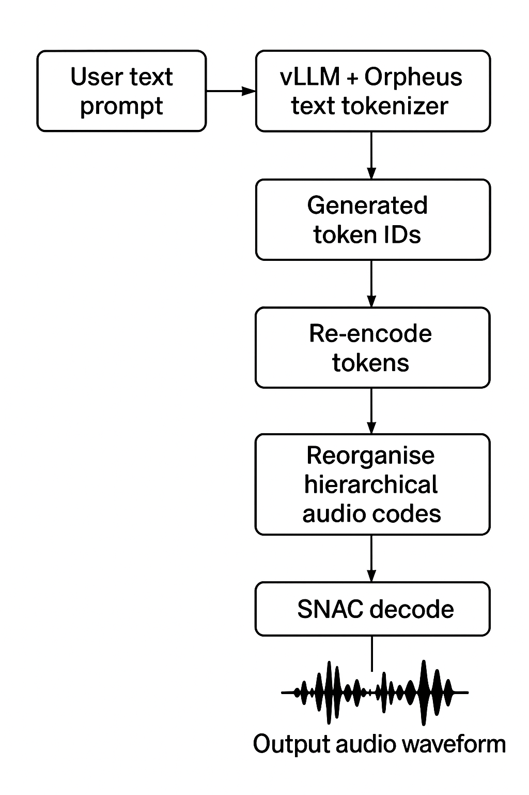

# Text-to-Speech Fine-Tuning with Unsloth

A folder for data prep and fine-tuning text-to speech models.

Recommended pre-watching
1. [Intro to TTS Models](https://www.youtube.com/watch?v=vfe8KIm1ubw).

Other links:
- [Sesame CSM-1B Model Blog](https://www.sesame.com/research/crossing_the_uncanny_valley_of_voice)
- [Orpheus 3B Model Blog](https://canopylabs.ai/model-releases)

Key files/folders:
- `Trelis_Unsloth_CSM_1B_Finetuning.ipynb`: a Jupyter notebook to fine-tune the Sesame CSM-1B model. Works with full fine-tuning or LoRA.
- `Trelis_Unsloth_Orpheus_Finetuning.ipynb`: a Jupyter notebook to fine-tune the Orpheus model. Works with full fine-tuning or LoRA.
- `orpheus_vllm_client.py`: a script to generate audio from Orpheus TTS models (not working yet).
- `audio-samples`: Contains audio samples for CSM-1B, Orpheus and ElevenLabs clones and zero shot.

## Fine-tuning
Make use of the Jupyter notebooks to fine-tune the models. 

## Inference
Unfortunately inference of TTS models is poorly supported.

The only well supported of these models - by vLLM - is Orpheus, and even that is via a hack that allows for proper decoding of the tokens produced by vLLM.

To run inference, you can run orpheus with vllm using [this one click template (affiliate)](https://www.runpod.io/console/deploy?template=wrce975nbo). You can run the script `orpheus_vllm_client.py` to generate audio from the model:

```bash
uv run --script orpheus_vllm_client.py --prompt "Sing along together now: Red and yellow and pink and blue, orange and purple and green..." --voice Ronan
```
Make sure to update the model ID and the runpod pod id in the script first.

### Brief notes on vLLM with Orpheus

- vLLM will load the tokeniser for the Orpheus model, which converts text into tokens. This is different than the snac tokenizer used for tokenising audio.
- The text will correctly go into vLLM and vLLM outputs tokens, BUT then decodes them with the text tokeniser! not the snac tokeniser.
- The solution then is to:
1. Re-encode the output tokens using the text tokeniser
2. Properly reorganise the token ids according to the orpheus hierarchical setup
3. Decode using the snac tokeniser to get output audio

Here's how vLLM handles Orpheus:


And here's the hack to encode and decode those tokens as sound:
